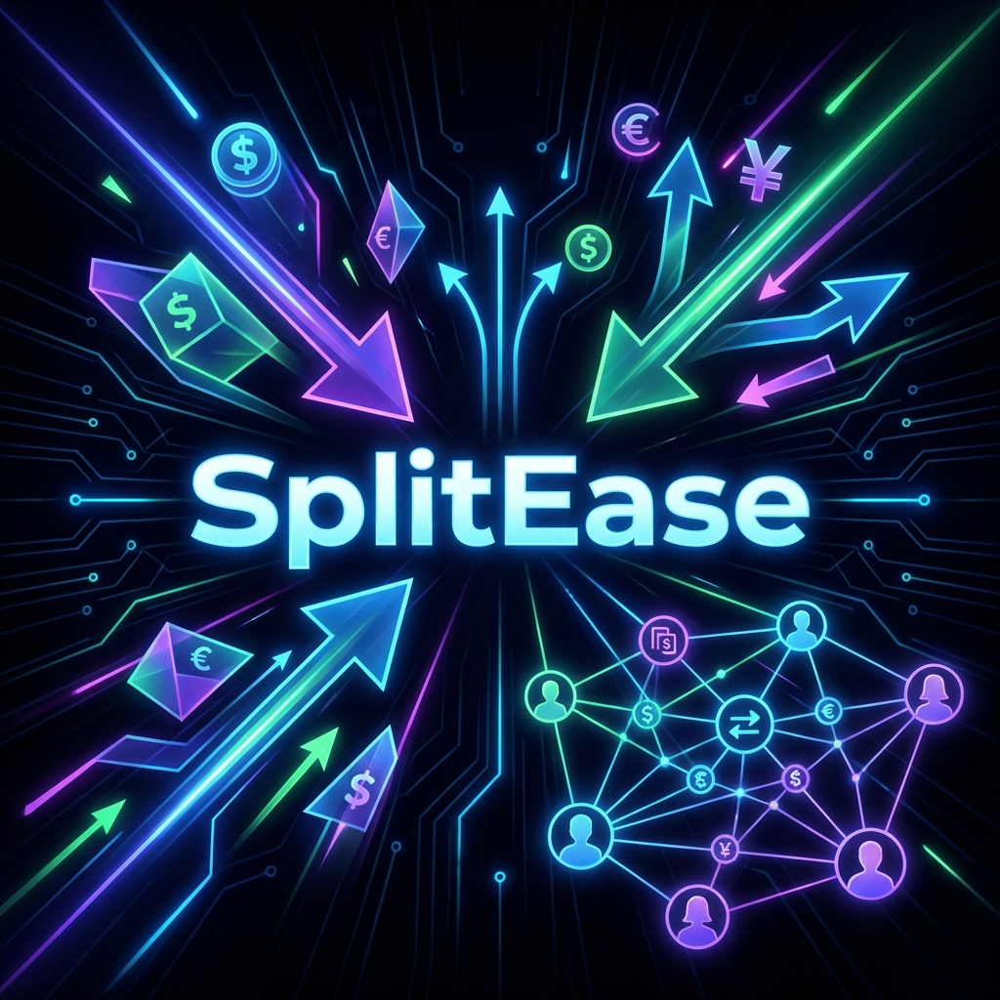

# SplitEase



SplitEase is a modern expense splitting application designed to make managing shared costs with friends and groups effortless. Built with a sleek, dark-themed UI, it offers a seamless experience for tracking balances and settling up.

## Features

- **Group Management**: Create groups and add members to split expenses easily.
- **Friend System**: Add friends and manage direct expenses.
- **Expense Tracking**: detailed expense logging with dates and categories.
- **Smart Splitting**: Automatically calculates who owes whom.
- **Dark Mode UI**: A beautiful, eye-friendly dark interface built with TailwindCSS.
- **Secure Authentication**: Robust user registration and login system.

## Tech Stack

**Backend:**
- **Node.js & Express**: Fast and scalable server-side runtime.
- **MongoDB & Mongoose**: Flexible NoSQL database for storing data.
- **TypeScript**: Type-safe development for better code quality.
- **JWT**: Secure JSON Web Token authentication.

**Frontend:**
- **React**: Dynamic and responsive user interface.
- **Vite**: Next-generation frontend tooling.
- **TailwindCSS**: Utility-first CSS framework for rapid UI development.
- **TypeScript**: Typed JavaScript for robust frontend logic.

## Getting Started

### Prerequisites
- Node.js (v18 or higher)
- MongoDB installed locally or a MongoDB Atlas connection string.

### Installation

1.  **Clone the repository:**
    ```bash
    git clone https://github.com/yourusername/splitease.git
    cd splitease
    ```

2.  **Backend Setup:**
    ```bash
    cd backend
    npm install
    # Create a .env file based on .env.example (if available) or configure:
    # PORT=5000
    # MONGO_URI=your_mongodb_uri
    # JWT_SECRET=your_jwt_secret
    npm run dev
    ```

3.  **Frontend Setup:**
    ```bash
    cd ../frontend
    npm install
    npm run dev
    ```

4.  **Open the App:**
    Visit `http://localhost:5173` (or the port Vite exposes) in your browser.

## Contributing

Contributions are welcome! Please feel free to submit a Pull Request.

## License

This project is licensed under the ISC License.
